# Small Component Defect Dataset

KEC `KIA7809AF`로 식별된 소형 전원 반도체 사진 17장을 직접 수동 검수해, specimen 상태와 사진에서 보이는 결함을 분리한 dataset입니다. 최신 라벨은 `annotations/image_labels_v4.csv`입니다.

실데이터와 별도로, clean-back 복원본에서 자동 생성한 train-only synthetic 이미지 4,210장을 포함합니다. 이 수량은 기존 단일 부품 이미지 3,058장과 검정 컨베이어 위 다중 부품 장면 1,152장을 합한 값입니다. Multi-instance 자료는 v4 1,920개와 v5 3,840개, 총 5,760개의 component instance를 제공합니다. 모든 합성 release는 실제 specimen 수나 독립 평가 표본 수로 집계하면 안 됩니다.

## 저작권 및 이용 제한 / Copyright and use restrictions

> [!CAUTION]
> 이 repository는 검토와 시연을 위해 공개되었으며 **open source 또는 open data가 아닙니다**. 권리가 성립하고 `hkjung1011`이 보유하는 범위에서 © 2026 hkjung1011. All Rights Reserved.
>
> 관련 법령과 GitHub 이용약관에 따라 허용되는 열람 및 GitHub 기능 내 fork를 제외하고 추가 라이선스는 부여되지 않습니다. 사전 서면 허가 없이 코드, 합성데이터, 이미지, mask, annotation, label, metadata, checkpoint 및 문서를 외부 복제·수정·재배포·재호스팅·판매하거나, 상업적으로 이용하거나, 다른 dataset에 편입하거나, AI/ML 학습·평가·fine-tuning 또는 파생물 제작에 사용하도록 허가하지 않습니다. 자세한 내용은 [LICENSE](LICENSE)와 [LICENSE_STATUS.md](LICENSE_STATUS.md)를 확인하십시오.
>
> Public visibility is **not** an open-source or open-data license. Except for use permitted by applicable law and viewing or forking through GitHub's functionality under its Terms of Service, no additional permission is granted to reproduce, modify, redistribute, externally host, sell, commercially exploit, incorporate into another dataset, use for AI/ML training, evaluation or fine-tuning, or create derivatives without prior written permission.

## 합성 데이터 미리보기

아래 자료는 `synthetic-v2-700`의 7개 **합성 결함 class** 예시입니다. 실제 결함 사진이나 독립 specimen이 아니며, 모두 `TRAIN_ONLY / evaluation_eligible=NO`입니다. Overview의 각 행은 원본 합성 이미지와 mask overlay를 함께 보여줍니다.

[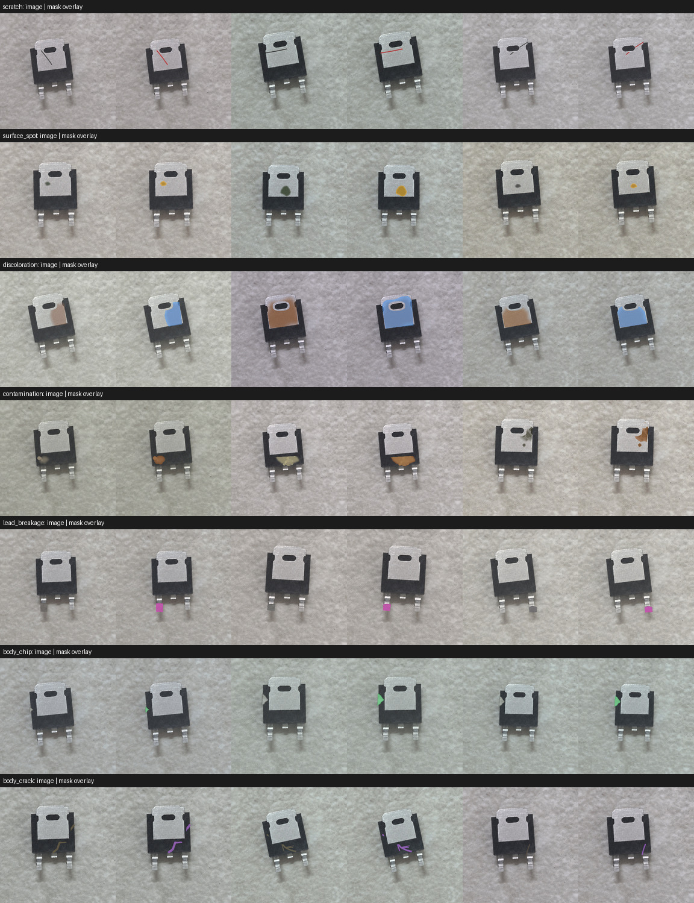](synthetic/v2_700/contact_sheet.jpg)

### 클래스별 대표 이미지

<table>
  <tr>
    <td align="center"><a href="synthetic/v2_700/images/scratch/syn-v2-700-scratch-0000.jpg">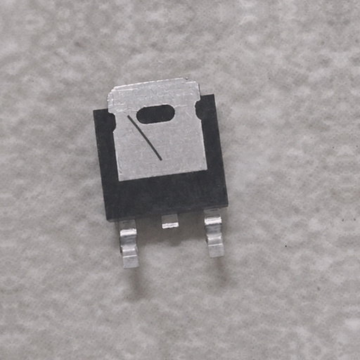</a><br><code>scratch</code><br>스크래치 · mild</td>
    <td align="center"><a href="synthetic/v2_700/images/surface_spot/syn-v2-700-surface_spot-0001.jpg">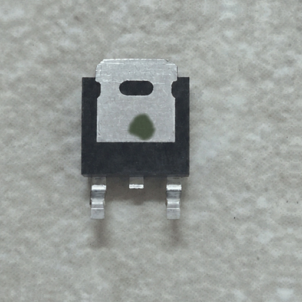</a><br><code>surface_spot</code><br>표면 반점 · moderate</td>
    <td align="center"><a href="synthetic/v2_700/images/discoloration/syn-v2-700-discoloration-0000.jpg">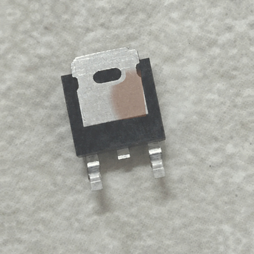</a><br><code>discoloration</code><br>변색 · moderate</td>
    <td align="center"><a href="synthetic/v2_700/images/contamination/syn-v2-700-contamination-0002.jpg">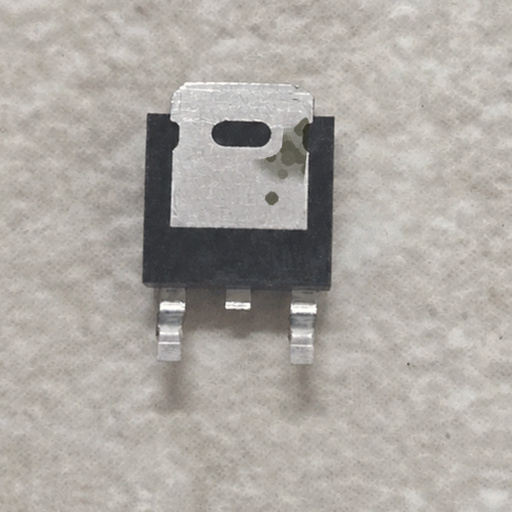</a><br><code>contamination</code><br>오염 · moderate</td>
  </tr>
  <tr>
    <td align="center"><a href="synthetic/v2_700/images/lead_breakage/syn-v2-700-lead_breakage-0000.jpg">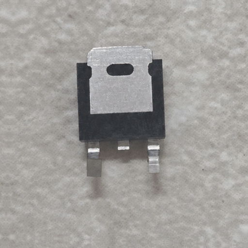</a><br><code>lead_breakage</code><br>리드 파손 · moderate</td>
    <td align="center"><a href="synthetic/v2_700/images/body_chip/syn-v2-700-body_chip-0001.jpg">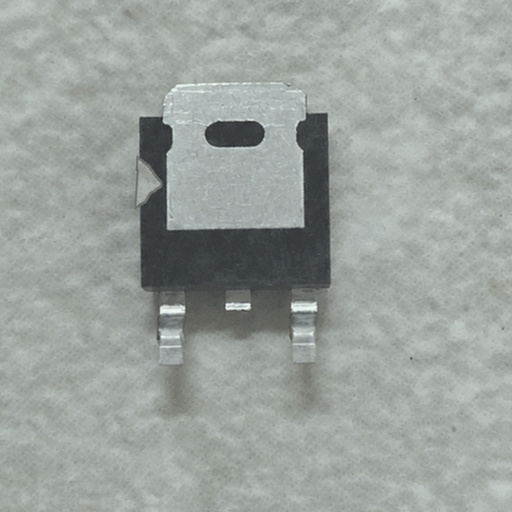</a><br><code>body_chip</code><br>바디 깨짐 · moderate</td>
    <td align="center"><a href="synthetic/v2_700/images/body_crack/syn-v2-700-body_crack-0000.jpg">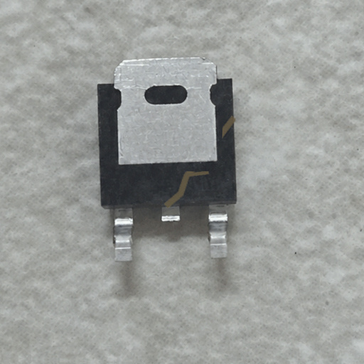</a><br><code>body_crack</code><br>바디 균열 · severe</td>
    <td align="center"><strong>전체 자료</strong><br><br><a href="synthetic/v2_700/images">700 images</a><br><a href="synthetic/v2_700/masks">700 pixel masks</a><br><a href="synthetic/v2_700/annotations/contact_sheets">class별 100장 QA sheets</a></td>
  </tr>
</table>

### 조명·촬영조건 증강 미리보기

`synthetic-v3-conditions`는 기존 `gradient_train` 결함 parent 168장의 형상과 mask를 고정하고 6가지 조명·카메라 조건을 적용한 1,008장 auxiliary release입니다. 아래 overview는 class×condition 예시이며, 평가 데이터로 사용할 수 없습니다.

[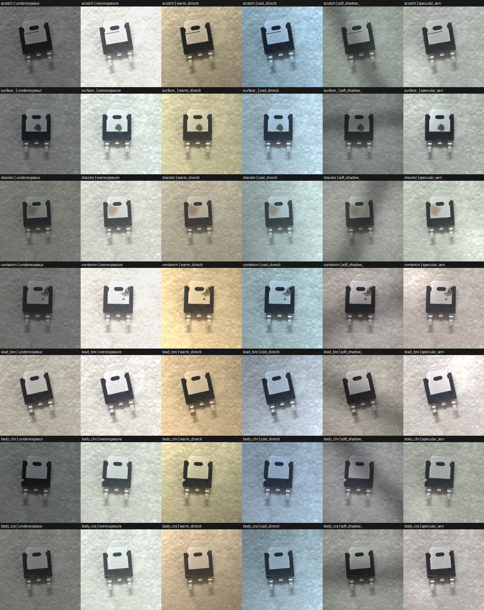](synthetic/v3_conditions/contact_sheet.jpg)

### 검정 컨베이어 다중 부품 미리보기

`synthetic-v4-conveyor`는 1280×720 검정 컨베이어 장면 384장에 부품을 5개씩 배치한 detection/segmentation 전용 train release입니다. 검정 belt는 어둡게 유지하고 네 가지 국소 조명 profile은 component alpha 내부에만 적용합니다. 아래 overview는 raw/annotation 예시입니다.

[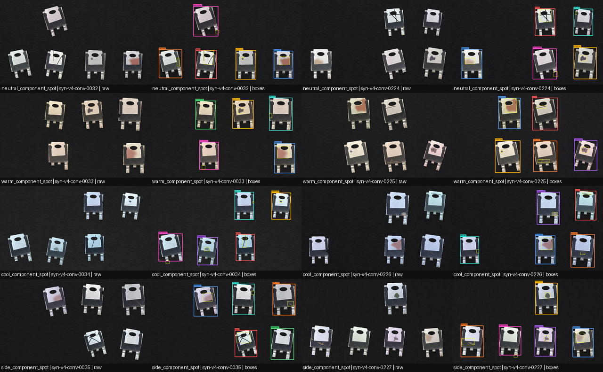](synthetic/v4_conveyor/contact_sheet.jpg)

이 자료의 1,920개 instance는 `normal_proxy` 240개와 7개 결함 status 각 240개로 균형화되어 있습니다. `normal_proxy`는 paired-clean 합성본일 뿐 실제 정상품이 아닙니다. 모든 장면은 `TRAIN_ONLY / evaluation_eligible=NO / classification_eligible=NO`입니다.

### Paired multi-light·조도 proxy 미리보기

`synthetic-v5-illumination`은 v4의 384개 composition을 각각 두 가지 조건으로 중립 replay한 768장 auxiliary release입니다. 한 화면에 2–3개 광원을 동시에 적용한 4개 rig, synthetic illuminance proxy `P0`–`P5`, contact/directional 2개 shadow regime을 48개 cell로 구성합니다.

<table>
  <tr>
    <td align="center"><a href="synthetic/v5_illumination/contact_sheet.jpg">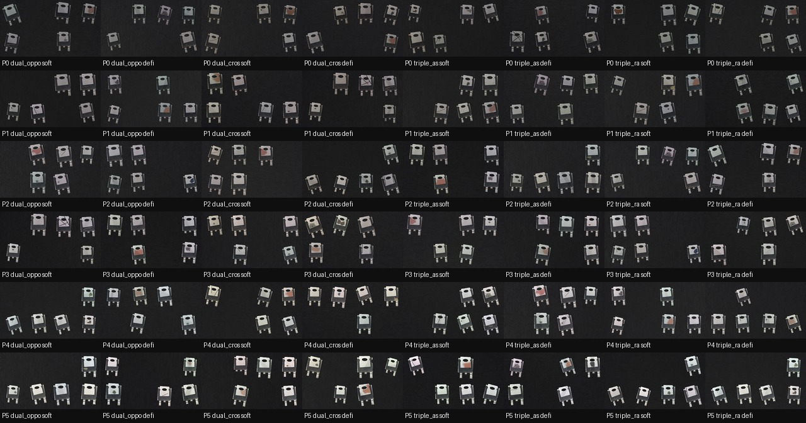</a><br>조건별 raw grid</td>
    <td align="center"><a href="synthetic/v5_illumination/contact_sheet_overlay.jpg">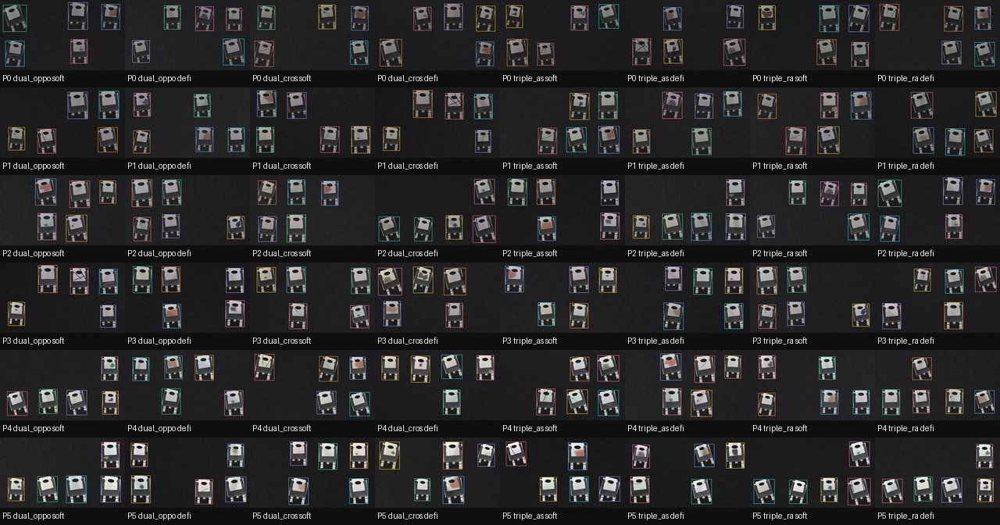</a><br>Annotation overlay</td>
    <td align="center"><a href="synthetic/v5_illumination/paired_condition_comparison.jpg">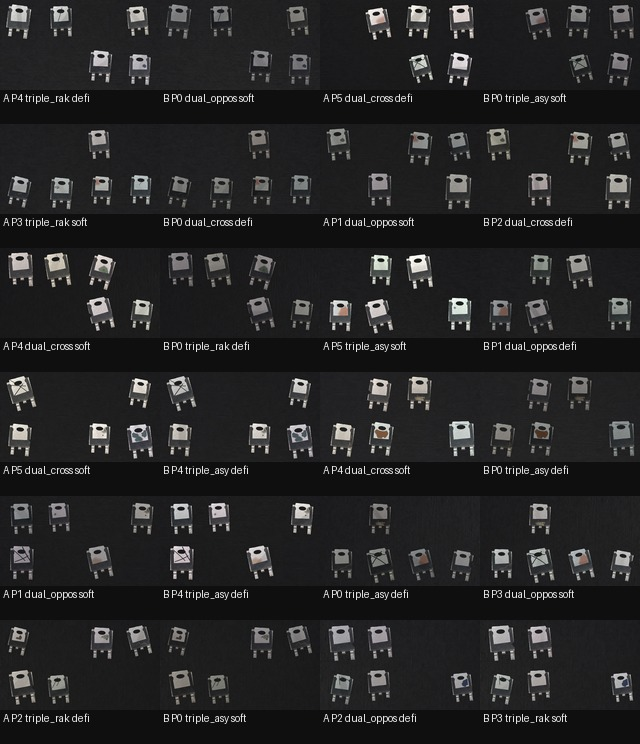</a><br>동일 composition paired 조건</td>
  </tr>
</table>

`P0`–`P5`의 `capture_plan_target_lux` 50/100/200/400/800/1600은 향후 실물 촬영 계획의 목표점이며 합성 이미지에서 측정한 lux가 아닙니다. v5는 `photometry_domain=SYNTHETIC_PROXY`, `measured_illuminance_lux=null`, `absolute_lux_eligible=NO`입니다. 두 variant와 v4 source는 같은 `composition_family_id`로 묶어 반드시 같은 train split에 두어야 합니다.

전체 조건 grid와 대표 P0/P5·soft/defined shadow 표본의 시각 검토는 [`annotations/synthetic_v5_illumination_human_qa.csv`](annotations/synthetic_v5_illumination_human_qa.csv)에 기록했습니다. 이는 합성 무결성 QA이며 실제 specimen 판정이나 실환경 검출 성능 측정이 아닙니다.

## 최종 판정

| 구분 | 사진 수 | 의미 |
|---|---:|---|
| `OK_confirmed` | 0 | 모든 필수 면에서 결함 없음이 확인된 정상품 |
| `NG_confirmed` | 13 | 사진 자체 결함 또는 같은 specimen의 반복 관찰로 NG 근거가 있는 사진 |
| `HOLD_unverified` | 4 | 화질 또는 다중 부품 장면 때문에 OK/NG 확정 불가 |

따라서 현재 17장 중 정상품 학습 negative로 사용할 수 있는 사진은 없습니다. `HOLD`도 정상품이 아니며, 재촬영 또는 instance-level 판정 전까지 학습에서 제외해야 합니다.

## Synthetic releases

| Release | 균형 단위 | 규모 | 조건 |
|---|---:|---:|---|
| `synthetic-v1` | class당 100장 | 900 images / 900 masks | seed `7809208`, ID `syn-v1-*` |
| `synthetic-v1-450` | class당 50장 | 450 images / 450 masks | 신규 random condition, seed `7809250`, ID `syn-v1-450-*` |
| `synthetic-v2-700` | 결함 class당 100장 | 700 images / 700 masks | 7개 결함 class, post-JPEG 512/224 QC, ID `syn-v2-700-*` |
| `synthetic-v3-conditions` | 결함 class당 144장 | 1,008 images / 1,008 masks | v2 gradient-train parent 24/class × 조명·카메라 6조건, ID `syn-v3-cond-*` |
| `synthetic-v4-conveyor` | status당 240 instances | 384 scenes / 1,920 instances / 768 masks | 검정 belt, 장면당 5개, component-only 조명 4조건, ID `syn-v4-conv-*` |
| `synthetic-v5-illumination` | status당 480 instances | 768 scenes / 3,840 instances / 2,304 masks | v4 composition당 paired 2조건, 4 rigs × P0–P5 × 2 shadows, ID `syn-v5-light-*` |

`synthetic-v1`과 `synthetic-v1-450`은 `normal_proxy`, scratch, surface spot, discoloration, contamination, lead breakage, body chip, body crack, multi-defect의 9개 primary class로 구성됩니다. `synthetic-v1-450`은 기존 900장의 subset이나 복사본이 아니라 다른 seed로 새로 생성한 450장입니다.

`synthetic-v2-700`은 scratch, surface spot, discoloration, contamination, lead breakage, body chip, body crack의 7개 결함 class만 포함합니다. 각 class는 `mild 40 / moderate 40 / severe 20`이고, paired-clean 비교로 JPEG 저장 후 512 px와 학습 입력 224 px에서 모두 가시성 gate를 통과했습니다. 정상 class는 포함하지 않으므로 이 release만 학습한 모델은 OK/NG 판정을 할 수 없습니다.

`synthetic-v3-conditions`는 v2의 `gradient_train` parent에만 연결되며 validation/test parent는 파생하지 않습니다. 기존 validation/test는 그대로 유지해야 하고 v3 variant를 평가에 넣으면 안 됩니다.

`synthetic-v4-conveyor`는 `normal_proxy`, scratch, surface spot, discoloration, contamination, lead breakage, body chip, body crack의 8개 component status를 사용합니다. COCO/YOLO detection label, 16-bit component instance-ID mask, 8-bit defect semantic mask를 함께 제공합니다. `normal_proxy` 240개에는 defect target이 없고, 나머지 1,680개에는 7개 결함 localization target이 있습니다. 같은 source family를 다른 split으로 나누지 말고 release 전체를 train에서만 사용해야 합니다.

`synthetic-v5-illumination`은 v4의 geometry·placement·label을 그대로 replay하면서 검정 belt, component-only positive light, multi-source lighting, contact/directional shadow와 sensor condition을 적용합니다. 48개 condition cell은 각 16 scenes이고 class별 cell count는 9–11 instances입니다. Paired-clean reference로 결함 가시성을 자동 검사하지만 새 실제 정상품이나 실물 조명 사진을 추가하지는 않습니다. 실측 조명 촬영은 [실물 조명 촬영 프로토콜](docs/REAL_LIGHTING_CAPTURE_PROTOCOL.md)과 [capture manifest template](annotations/real_lighting_capture_template.csv)을 사용하며 현재 해당 실물 이미지는 0장입니다.

현재 저장된 `model_final.pt` 3개는 기존 `synthetic-v2-700`의 단일 부품 7-class classifier 결과입니다. v3/v4/v5 condition data로 재학습한 checkpoint가 아니며, 다중 부품 전체 장면을 입력받는 detector도 아닙니다. 여러 새 사진을 일괄 판독하려면 v4/v5를 train-only auxiliary로 사용하는 별도 detector/segmenter를 학습하고 독립 실물 test set으로 검증해야 합니다.

Synthetic 자료는 모두 `TRAIN_ONLY / evaluation_eligible=NO`입니다. 실제 정상품이나 독립 실물 specimen 수로 집계하면 안 됩니다. 자세한 생성 조건·라벨·QA는 [synthetic-v1 문서](docs/SYNTHETIC_DATA.md), [synthetic-v1-450 문서](docs/SYNTHETIC_DATA_V1_450.md), [synthetic-v2-700 실험 보고서](docs/SYNTHETIC_DATA_V2_700.md), [synthetic-v3 조건 증강 문서](docs/SYNTHETIC_DATA_V3_CONDITIONS.md), [synthetic-v4 컨베이어 문서](docs/SYNTHETIC_DATA_V4_CONVEYOR.md), [synthetic-v5 다중 조명 문서](docs/SYNTHETIC_DATA_V5_ILLUMINATION.md)에 있습니다. 학습·batch inference 구조는 [detection 안내](training/detection/README.md)를 참고하십시오.

## 재감사에서 바뀐 항목

- `20260827_171929`, `20260827_171931`: 두 frame의 동일 위치에서 곡선형 손상이 반복되어 `scratch confirmed`로 승격했습니다.
- `20260827_171611`, `20260827_171925`: 점상 표면 이상은 확정했지만 `discoloration`과 `contamination` 중 어느 것인지는 보류했습니다.
- `20260827_171925`: outer lead 변형은 검토 대상으로 유지하고 `breakage confirmed`로 확정하지 않았습니다.
- 전면이 깨끗한 4장은 `no_visible_defect_on_view`일 뿐, specimen 기준 정상품으로 사용하지 않습니다.

## 폴더

```text
annotations/                    사진별 라벨과 source hash
configs/synthetic_v1.json       합성 class, ROI, seed, domain-randomization 설정
configs/synthetic_v1_450.json   클래스당 50장 신규 release 설정
configs/synthetic_v2_700.json   7개 결함 class, severity, dual-resolution QC 설정
configs/synthetic_v3_conditions.json  train parent 전용 조명·촬영조건 설정
configs/synthetic_v4_conveyor.json  검정 컨베이어 다중 부품 장면 설정
configs/synthetic_v5_illumination.json  paired multi-light·synthetic proxy 설정
data/by_specimen_status/        OK / NG / HOLD 상호배타 분류
data/by_visible_class/          사진에서 보이는 결함의 multi-label export
data/crops_by_specimen_status/  단일 부품 crop 보조본
docs/                           재감사, 라벨 정책, 부품 식별, 공식 출처
scripts/validate_dataset.py     수량, 경로, SHA-256, 라벨 불변조건 검사
scripts/generate_synthetic.py   image, mask, manifest 동시 생성
scripts/generate_synthetic_v1_450.py  신규 450장 release 생성
scripts/validate_synthetic.py   synthetic image/mask/label/hash 검사
scripts/generate_synthetic_v2_700.py  700장 paired-clean post-JPEG QC 생성
scripts/validate_synthetic_v2_700.py  700장 512/224 QC 독립 replay 검증
scripts/generate_synthetic_v3_conditions.py  168 parent × 6조건 auxiliary 생성
scripts/validate_synthetic_v3_conditions.py  계보·누수·조건·512/224 replay 검증
scripts/generate_synthetic_v4_conveyor.py  384개 다중 부품 장면·COCO/YOLO/mask 생성
scripts/validate_synthetic_v4_conveyor.py  전체 384장 batch replay·라벨·QC 검증
scripts/generate_synthetic_v5_illumination.py  v4 384 composition × paired 2조건 생성
scripts/validate_synthetic_v5_illumination.py  v5 계보·조명·shadow·paired-clean replay 검증
scripts/validate_real_lighting_capture_manifest.py  실물 조명 촬영 manifest schema·계보 검증
synthetic/sources/              clean base와 생성 provenance
synthetic/v1/                   900 images, 900 masks, 자동 라벨과 QA
synthetic/v1_450/               450 images, 450 masks, 자동 라벨과 QA
synthetic/v2_700/               700 images, 700 masks, full contact sheets
synthetic/v3_conditions/        1,008 train-only condition images/masks
synthetic/v4_conveyor/          384 train-only scenes, 1,920 component instances
synthetic/v5_illumination/       768 train-only scenes, 3,840 component instances
annotations/real_lighting_capture_template.csv  실측 조명 촬영용 빈 manifest template
training/                       고정 split, ResNet-18 학습·평가·3-seed 집계
```

## 부품 식별

사진 마킹은 회전 후 `KIA / 7809AF / 208`로 읽히며, KEC 공식 marking specification과 일치합니다. Base model은 `KIA7809AF`, 기능은 `9 V / 1 A three-terminal positive standard voltage regulator`, package family는 `DPAK / DPAK(3)`입니다. `208`은 모델 suffix가 아니라 `2022년 08주차` lot code입니다. 정확한 ordering suffix와 DPAK 세부 variant는 사진만으로 확정하지 않았습니다.

자세한 근거는 [docs/PART_IDENTIFICATION.md](docs/PART_IDENTIFICATION.md), 공식 문서는 [docs/SOURCES.md](docs/SOURCES.md), 라벨 한계는 [docs/AUDIT_REPORT.md](docs/AUDIT_REPORT.md)를 참고하십시오.

사진별 수동 판정과 학습 포함/제외 결정은 [docs/MANUAL_LABELING_REPORT.md](docs/MANUAL_LABELING_REPORT.md)에 기록했습니다.

## 검증

```powershell
py -3.14 -B scripts\validate_dataset.py
py -3.14 -B scripts\validate_synthetic.py
py -3.14 -B scripts\validate_synthetic.py --config configs\synthetic_v1_450.json --release synthetic\v1_450
py -3.14 -B scripts\validate_synthetic_v2_700.py
py -3.14 -B scripts\validate_synthetic_v3_conditions.py
py -3.14 -B scripts\validate_synthetic_v4_conveyor.py
py -3.14 -B scripts\validate_synthetic_v5_illumination.py
py -3.14 -B scripts\validate_real_lighting_capture_manifest.py --schema-only
python training/scripts/train_eval_classifier.py --check-only
python training/scripts/train_eval_classifier.py --check-only --auxiliary-condition-manifest synthetic/v3_conditions/annotations/manifest.csv
```

성공 시 real label audit은 `OK=0, NG=13, HOLD=4`, 기존 단일 부품 synthetic validator는 각각 `synthetic=900`, `synthetic=450`, `synthetic=700`, `synthetic=1008` PASS를 출력합니다. v4 validator는 384개 장면과 1,920개 instance를, v5 validator는 768개 장면과 3,840개 instance를 deterministic replay하며 COCO/YOLO/mask/계보/조명·shadow·paired-clean QC를 검사합니다. 실물 manifest의 `--schema-only`는 99개 column schema를 검사하며 실물 image가 추가되었다는 뜻이 아닙니다. 이 batch validator들은 dataset 생성 무결성 검사이지 새 현장 사진의 결함을 판독하는 trained-model inference가 아닙니다. 마지막 classifier preflight는 기존 validation/test를 바꾸지 않고 `effective_gradient_train_sample_count=1176`인지 확인합니다.

## 사용 제한

이 저장소에는 공개 재사용 라이선스가 부여되지 않았습니다. 세부 조건은 [LICENSE_STATUS.md](LICENSE_STATUS.md)를 따릅니다. 사진 기반 외관 판정은 전기적 정상성, 진품 여부, 안전성 또는 양산 합격을 보증하지 않습니다.
